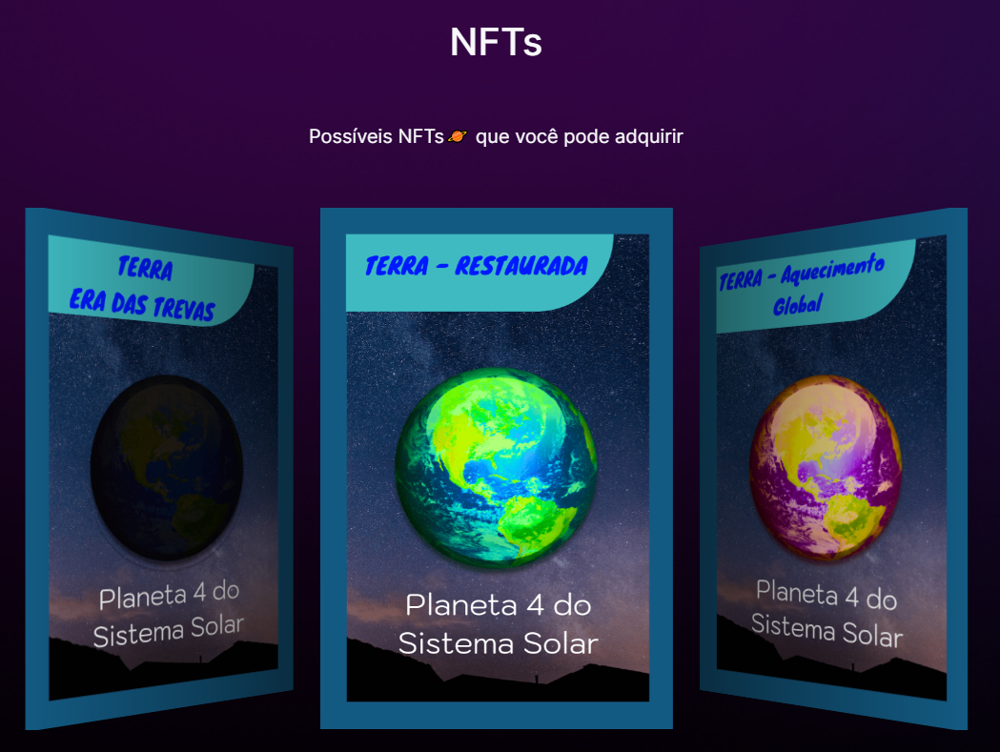
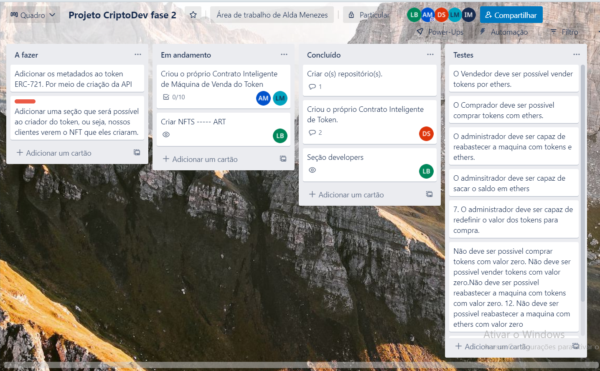

 <h1 align=center>CriptoSpace NFT - <a target="_blank" href="https://cripto-space-front.vercel.app" rel="nofollow">Versão 1.0</a> </h1>
<div id="header" align="center">
  
</div>

<p align=center>
  
  
  
   
 
 
</p>

<h1>  👥Equipe: <br></h1>
<uL> 
	<li> <a href="https://www.linkedin.com/in/aldamenezes/">Alda Aparecida Menezes </a><br></li>
	<li> <a href="https://github.com/[user]/"> Daniel Santos</a><br></li>
	<li> <a href="https://github.com/mesquitaoliveira/"> Ismael Mesquita</a><br></li>
	<li> <a href="https://github.com/[user]/"> Lucas Matheus</a><br></li>
	<li> <a href="https://github.com/[user]/"> Lázaro<br></a></li>
</ul>

<h1 align=center>Dapp NFT CriptoSpace<br></h1>

Esse é um projeto full stack de contrução de um Dapp. As tecnologias usadas dividiveremos em duas
partes:

<ul>
  <li><a href="#front">Front-end</a></li>
  <li><a href="#back">Back-end</a></li>
</ul>

Para ajudar no planejamento do Projeto foi utilizados ferramentas como:

<ul>
  <li><a href="#zoom">Zoom</a></li>
  <li><a href="#kanban">Método Kanban</a></li>
  <li><a href="#figma">Figma</a> </li>
</ul>

<h1 id="frontend">Front-end</h1>

Nessa seção utilizamos: 

<ul>
  <li><a href="#next">Nextjs</a></li>
  <li><a href="#style">Bootstrap / Reactstrap / Swiperjs / CSS</a></li>
</ul>


<h1 id="backend">Back-end</h1>

<ul>
  <li><a href="#hardhat">Hardhat</a></li>
  <li><a href="#openzeplin">Openzeppelin</a></li>
  <li><a href="#alchemy">Alchemy</a></li>
</ul>

<h1 id="next">Nextjs</h1>

Utilizamos o Next.js que é um framework React para desenvolvimento front-end, com renderização do lado servidor.

<h1 id="style">Bootstrap / Reactstrap / Swiperjs / CSS</h1>

Biblioteca de componentes web pra frontend que foram aplicadas no projeto.

Um exemplo de componente que foi aplicado no projeto:



<h1 id="hardhat">Hardhat</h1>

Um ambiente de desenvolvimento para Ethereum, auxiliando na criação do projeto smart contract, como deploy, testes, mineração.

<h1 id="hardhat">Openzeppelin</h1>

Biblioteca de smart contracts padrões para a criação do token. Uma biblioteca que é testada por diversos desenvolvedores da tecnologia blockchain.

<h1 id="zoom">Zoom</h1>

Usamos o Zoom um programa de videoconferência online, que permite reunir toda a equipe de desenvolvimento para debater e discutir sobre o projeto

<h1 id="kanban">Método Kanban</h1>

Para o controle do fluxo de desenvolvimento deste código foi utilizado o modelo Kanban feito na ferramenta Trello



<h1 id="figma">Figma</h1>

Os designers NFTs foram criadas utilizando o Figma e biblioteca de imagens gratuitas como unsplah e icon-icon.
[Link do Figma](https://www.figma.com/file/zm5eCRDvqPjX3ONhXNROli/Cards-NFT-CriptoSpace?node-id=0%3A1)

<h1 id="deploy">Como Executar</h1>

### Deploy 
Para facilitar a visualização da aplicação, ela já foi colocada no ar com auxílio do [vercel](https://vercel.com/), assim como foi solicitado , e seu deploy pode ser acessado no seguinte link: [Cripto-Space.](https://cripto-space-front.vercel.app/)

Além disso, pode-se optar ainda por clonar este repositório e utilizar, por exemplo,  lendo as instruções a seguir.

### Executando Localmente
1. Primeiro passo
```
git clone https://github.com/mesquitaoliveira/cripto-space-front.git
```
2. Em seguida entre no diretório usando o terminal
```
cd cripto-space-front
```
3. Depois de selecionado o diretório digite no terminal.
```
yarn install

or 

npm install
```
4. E por último execute um dos seguintes commandos, que deve ter a mesma primeira palavra chave do comando anterior.
````
yarn dev

or

npm run dev
````

Por fim poderá usar a IDE de sua escolha para testar essa aplicação.
